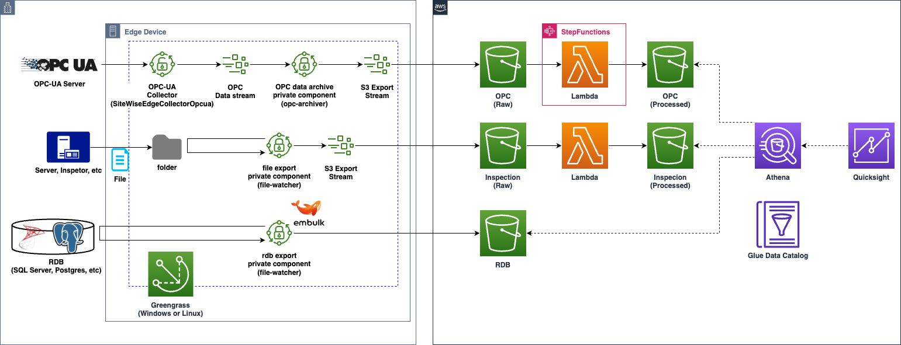

# 産業用データプラットフォーム　スターターキット

English doc coming soon.

生産現場のデータ活用をしようにも、「PoC で止まってしまい運用まで辿り着かない」「どう AWS 上で実現したら良いかわからない」「予算がタイトなためスモールスタートしたい」というケースはありませんか？このプロジェクトは、そんなお悩みを解決することを目的に作成された、産業用のデータプラットフォームを作成するサンプルプロジェクトです。お手持ちの設備データや画像データ、テキストデータ、RDB に蓄積されたデータを S3 へ収集し、活用できる状態にします。停電復旧後やネットワーク障害後のデータ再送処理は、エッジデバイス上にインストールされた[AWS IoT Greengrass](https://aws.amazon.com/greengrass/)がカバーします。従量課金のため、予算がタイトなケースにおいても適用可能です。デプロイは[AWS CDK](https://aws.amazon.com/cdk/)により自動化されているため、すぐに開始することができます。

## 想定するユースケース

数時間から日次・月次のデータ活用を想定しています。具体的には下記の用途を想定しています:

- 日次・週次レポート作成
- KPI や傾向の把握
- 過去データの多変量解析などによる統計分析
- 過去データを分析するための独自のアプリ用データソース

したがって、リアルタイム性が重要視されるようなケース、例えば「1 分ごとに新しく取得される DCS や PLC のデータを監視したい」「設備の異常を検知し即座にアラートを上げたい」といったケースには不向きです。オンプレ (SCADA や DCS など) での監視や[AWS IoT SiteWise](https://aws.amazon.com/iot-sitewise/)などのサービスをご検討ください。

## 収集対象となるデータ

下記のデータソースを想定しています。

- 設備データ
  - OPC-UA プロトコルに対応
- ファイル
  - テキスト (csv, json など)
    - SCADA や PIMS、リレーショナルデータベースから出力したテキストファイル
  - 画像 (png, jpg, pdf など)

## アーキテクチャ

エッジのゲートウェイデバイスにインストールされた Greengrass により、OPC-UA データおよびファイルを収集し S3 へアップロードします。収集されたデータは[AWS Lambda](https://aws.amazon.com/lambda/)により加工された後、[Amazon QuickSight](https://aws.amazon.com/quicksight/)で可視化・分析することができます。

なお本プロジェクトでは IoT SiteWise のデータ保存や可視化機能は利用していませんが、OPC データの収集にのみ IoT SiteWise の機能を利用しています。具体的には[IoT SiteWise OPC-UA コレクター](https://docs.aws.amazon.com/greengrass/v2/developerguide/iotsitewise-opcua-collector-component.html)コンポーネントを利用し、opcua-archiver 経由でデータを S3 へ転送しています。opcua-archiver および file-watcher はそれぞれ本プロジェクトに含まれる独自の Greengrass コンポーネントです。

OPC データ収集直後の S3 バケット (OPC (Raw) バケット) では OPC タグによるパーティショニングがされていない状態のため、タグを指定しクエリする場合にスキャン量が増えてしまうため非効率的です。後続の Lambda は 1 時間に 1 度、OPC タグによるパーティショニングを実行し、OPC (Processed) バケットに保存します。これによりタグ指定によるクエリが可能となり、クエリの料金節約やレスポンスの高速化が可能になります。収集後 1 時間未満の鮮度が必要な場合は Raw バケットを参照ください。

ファイルデータの加工処理はフォーマットの整形などの用途を想定しており、任意の実装が可能です。なおファイル加工用の Lambda は Raw バケットにデータが到着後、即座に実行されます。

## はじめかた

[こちら](./docs/ja/getting_started_ja.md)のドキュメントを参照ください。なお、お手元にデータソースがない場合を想定し、ダミーの OPC-UA サーバ・ダミーの仮想ゲートウェイをサンプルとして含めています。動作の理解を深めるためにも、ぜひご活用ください。

## 付録

- [Athena によるクエリ例](./docs/ja/athena_example.md)
  - Athena で OPC データをクエリする実践的な SQL の例を掲載しています
- [各コードの編集すべき箇所について](./docs/ja/edit.md)
  - お客様の環境で修正が必要と考えられる箇所やその手順について紹介します
