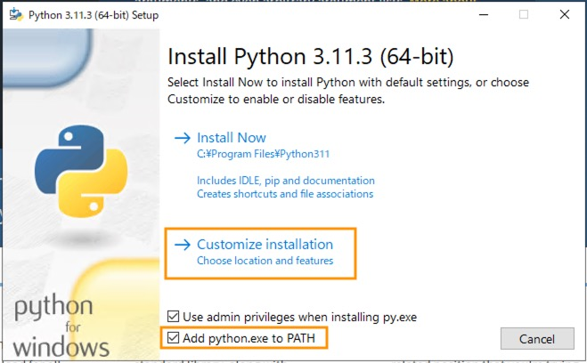
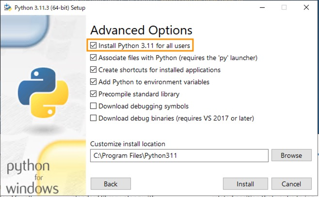

# 実環境への適用

ここでは実際のデータソースへ接続し S3 へデータを吸い上げる手順について解説します。本サンプルの基本的な動作確認については既に終えていることを前提としているため、まだの場合は[こちら](./getting_started_ja.md)をお読みいただくことをおすすめします。

## (Optional) RDB テーブルの設定

RDB のデータを吸い上げる場合はいくつかの事前設定が必要です。

### Glue DataCatalog の設定

Athena でクエリするため[datacatalog.ts](../../cdk/lib/constructs/datacatalog.ts)にスキーマの定義が必要です。既存のサンプル実装および吸い上げたいオンプレのテーブルスキーマを参考に、定義を記述してください。なおこの CDK 実装は Athena の[CREATE TABLE](https://docs.aws.amazon.com/ja_jp/athena/latest/ug/create-table.html)ステートメントに対応します。

```ts
const gradeMasterTable = new glue.Table(this, "GradeMasterTable", {
  database: IndustrialPlatformDatabase,
  tableName: "grade_master",
  // カラムの定義
  columns: [
    { name: "grade_id", type: glue.Schema.STRING },
    { name: "grade_name", type: glue.Schema.STRING },
  ],
  dataFormat: glue.DataFormat.CSV,
  compressed: false,
  bucket: props.storage.rdbArchiveBucket,
  s3Prefix: "prototype/GradeMaster/",
});
const cfnGradeMasterTable = gradeMasterTable.node
  .defaultChild as aws_glue.CfnTable;
cfnGradeMasterTable.addPropertyOverride("TableInput.Parameters", {
  "skip.header.line.count": "1", // ignore header column
  "projection.enabled": true,
  "storage.location.template": `s3://${props.storage.rdbArchiveBucket.bucketName}/prototype/GradeMaster/`,
});
```

### Embulk コンフィグレーションの記述

ETL の定義を[components/rdb-exporter/src/conf/](../../components/rdb-exporter/src/conf/)下にある liquid ファイルに記述します。本リポジトリには銘柄テーブル (grade_master.yml.liquid) および生産実績テーブル (batch_production_record.yml.liquid) のサンプルを含めておりますので参考にしてみてください。一回の Embulk 実行時にすべての liquid ファイルを検出し実行される仕様となっておりますので[（詳細）](../../components/rdb-exporter/src/main.py)、吸い上げ対象のテーブル数分ファイルを作成ください。詳細は公式の[Embulk configuration file format](https://www.embulk.org/docs/built-in.html)をご確認ください。

なお`incremental`のオプションは実績テーブルのように追加されていくテーブルを対象とする場合は`true`に設定することをおすすめします。このようにすることで、実行時にどこまで実行したか・次回どこから実行すべきかの情報を保存し、Embulk 一度あたりの実行時間を短縮することができます。詳細は[Incremental loading](https://github.com/embulk/embulk-input-jdbc/blob/master/embulk-input-jdbc/README.md#incremental-loading)を参照ください。

### Embulk プラグインのインストール

本サンプルでは Postgres を対象としています。他の DB を利用される場合は Embulk プラグインのインストールが必要です。エッジ OS が Linux の場合[install.sh](../../components/rdb-exporter/install.sh), Windows の場合[install.p1](../../components/rdb-exporter/install.p1) をそれぞれ編集してください。たとえば Linux の場合は下記の箇所を編集します。

```sh
...略...
echo "Installing embulk plugins..."
...略...
# SQL Serverの場合はembulk-input-sqlserverへ変更する
java -jar ${EMBULK_EXEC_PATH} gem install embulk-input-postgresql
...略...
```

### Postgres をご利用の場合

Embulk プラグインの[PostgreSQL input plugin for Embulk](https://github.com/embulk/embulk-input-jdbc/tree/master/embulk-input-postgresql)を利用するにあたり、下記の制限事項があります点にご留意ください。

- パスワード認証方式: md5 (SCRAM に未対応)

## AWS へのデプロイ

`cdk.json`の下記の箇所をお手元のデータソースに応じて編集します。不要なモジュールが存在する場合（例：RDB のデータ吸い上げは不要など）、適当なダミーの値をセットしてください。

```json
{
    ...略...,
    "opcuaEndpointUri": "opc.tcp://your-server:port",
    "sourceDir": "/path/to/source/dir",
    "rdbHost": "your-rdb-server-host",
    "rdbPort": "5432",
    "rdbUser": "user",
    "rdbPassword": "password",
    "rdbDatabase": "database name",
    "rdbExportIntervalSec": 60
}
```

`cdk/bin/industrial-data-platform.ts`を開き、`provisionVirtualDevice`および`provisionDummyDatabase`を`false`に変更します。

```ts
const platformStack = new IndustrialDataPlatformStack(
  app,
  "IndustrialDataPlatformStack",
  {
    ...略...,
    provisionVirtualDevice: false,
    provisionDummyDatabase: false,
  }
);
```

その後下記のコマンドにてリソースをデプロイします。

`cdk deploy IndustrialDataPlatformStack --require-approval never`

## エッジのデプロイ

### 想定環境

デバイスの想定環境を確認します。

まず[Greengrass 動作環境](https://docs.aws.amazon.com/greengrass/v2/developerguide/setting-up.html#installation-requirements) を参照し、サポートされているプラットフォームとデバイスの要件を確認してください。

続いて Python / Java をインストールします。Python はバージョン 3.9 以降、Java はバージョン 8 のインストールをお勧めします。なお Java は JDK インストールは不要です。また仮想デバイスでは[Amazon Corretto 8](https://aws.amazon.com/corretto/)をインストールしています。

### 準備

Greengrass インストーラーは必要な AWS リソースを自動的にプロビジョニングするため、インストーラー実行に際して AWS 認証情報が必要です。Greengrass インストール用の IAM ユーザを準備して、 Greengrass インストールを行う Windows 環境に環境変数としてアクセスキー情報を設定します。
このインストールを行う際に使用する AWS 認証情報に割り当てるべきな最低限の IAM ポリシーについては[こちら](https://docs.aws.amazon.com/greengrass/v2/developerguide/provision-minimal-iam-policy.html)を確認し作成いただくか、前章でデプロイした IndustrialPlatformStack で作成される IAM ポリシーをご利用ください (ポリシー名は CloudFormation > IndustrialPlatformStack の出力タブ > GreengrassInstallPolicyName を参照してください)。

ユーザを作成し、ユーザの `AWS_ACCESS_KEY_ID` と `AWS_SECRET_ACCESS_KEY` が取得できたら、ターミナル (Linux)またはコマンドプロンプト (Windows) を管理者権限で立ち上げ下記を入力します。

Linux の場合:

```
export AWS_ACCESS_KEY_ID=<AWS_ACCESS_KEY_ID>
export AWS_SECRET_ACCESS_KEY=<AWS_SECRET_ACCESS_KEY>
```

Windows の場合:

```
set AWS_ACCESS_KEY_ID=<AWS_ACCESS_KEY_ID>
set AWS_SECRET_ACCESS_KEY=<AWS_SECRET_ACCESS_KEY>
```

上記の手順で AWS_ACCESS_KEY_ID,AWS_SECRET_ACCESS_KEY を環境変数にセットしたターミナル (Linux)またはコマンドプロンプト (Windows)で下記作業を続行します。以下のコマンドをで入力して Greengrass パッケージをダウンロードし展開します。なお本手順は[こちら](https://docs.aws.amazon.com/greengrass/v2/developerguide/manual-installation.html#download-greengrass-core-v2)に記載されています。

Linux の場合:

```
curl -s https://d2s8p88vqu9w66.cloudfront.net/releases/greengrass-nucleus-latest.zip > greengrass-nucleus-latest.zip
unzip greengrass-nucleus-latest.zip -d GreengrassInstaller && rm greengrass-nucleus-latest.zip
```

Windows の場合:

```
powershell.exe -command "& {Invoke-WebRequest -Uri https://d2s8p88vqu9w66.cloudfront.net/releases/greengrass-nucleus-latest.zip -OutFile .\greengrass-nucleus-latest.zip; Expand-Archive -LiteralPath .\greengrass-nucleus-latest.zip -DestinationPath .\GreengrassInstaller}"
```

### 補足: Java のバージョン

Greengrass が必要とする Java のバージョンは 8 以降となっています。Java SE では v20 と最新版がリリースされていたり、Corretto でも v8,v11,v17,v20 がダウンロードできる状態です。Greengrass が動作するバージョンとしては v8 以降であればどのバージョンでも問題ありませんが、今回適用する SiteWise コンポーネントが、v17 以降で正常に動作しないことが確認されているため、v11 以前をインストールすることをお勧めします。また RDB のデータ転送には[Embulk](https://www.embulk.org/)を利用している都合により Java8 が必要です。RDB 転送が不要な場合は v11 もご利用可能です。

### 補足: Windows 環境の Python のインストール

Python セットアップ時に PATH 環境変数への追加と、すべてのユーザで Python を実行可能なようにインストールする必要があります。
セットアップ中の Add python.exe to PATH のチェックボックスへのチェック及び、カスタマイズインストールの Advanced Options で Install Python 3.xx for all users を選択してインストールを行なってください。




## Greengrass ユーザのセットアップ

Greengrass 用のユーザーを作成します。

### Linux の場合

エッジデバイスが Linux の場合、下記のコマンドを実行します。

```
sudo adduser --system ggc_user
sudo groupadd --system ggc_group
```

### Windows の場合

管理者として Windows コマンドプロンプト cmd.exe を開き下記コマンドを実行しユーザを作成します。`<password>`は安全なパスワードに置き換えてください。また、Greengrass が使用するユーザ名は通常 ggc_user となります。特別な理由がない限りはこのユーザ名を使用するようにしてください。

```
net user /add ggc_user <password>
```

Windows の構成によっては、ユーザパスワードの期限切れが設定されている場合があります。Greengrass アプリケーションを継続的に動作させるためには、作成したユーザのパスワードを期限切れまでに更新するか、期限切れを起こさないように設定します。
下記コマンドでパスワード期限について確認できます。

```
net user ggc_user | findstr /C:expires
```

ユーザのパスワード期限が切れないように設定するには下記のコマンドを実行します。

```
wmic UserAccount where "Name='ggc_user'" set PasswordExpires=False
```

また、作成したデフォルトユーザのアカウント情報を LocalSystem アカウントの認証情報マネージャインスタンスに格納する必要があります。PsExec ユーティリティを使用する必要があるため、ダウンロードの上、下記のコマンドを実行します。パスワードは ggc_user 作成時に設定したパスワードに置き換えてください。

```
psexec -s cmd /c cmdkey /generic:ggc_user /user:ggc_user /pass:<password>
```

## Greengrass のインストール

Greengrass パッケージをダウンロードし展開します。

### Linux の場合

### Windows の場合

ユーザの AWS_ACCESS_KEY_ID と AWS_SECRET_ACCESS_KEY が取得できたら、コマンドプロンプトを管理者権限で立ち上げ下記を入力します。

```
set AWS_ACCESS_KEY_ID=<AWS_ACCESS_KEY_ID>
set AWS_SECRET_ACCESS_KEY=<AWS_SECRET_ACCESS_KEY>
```

上記の手順で AWS_ACCESS_KEY_ID,AWS_SECRET_ACCESS_KEY を環境変数にセットしたコマンドプロンプトで下記作業を続行します。
以下のコマンドをで入力して Greengrass パッケージをダウンロードし展開します。

```
powershell.exe -command "& {Invoke-WebRequest -Uri https://d2s8p88vqu9w66.cloudfront.net/releases/greengrass-nucleus-latest.zip -OutFile .\greengrass-nucleus-latest.zip; Expand-Archive -LiteralPath .\greengrass-nucleus-latest.zip -DestinationPath .\GreengrassInstaller}"
```

[エッジゲートウェイデバイスへ Greengrass をインストール](./deploy_edge_ja.md)を参考にイン
ストールします。CloudFormation の出力タブに表示されるコマンドをエッジデバイス上のターミナルまたはコマンドプロンプトで実行してください（デバイスの OS が Linux の場合は`GreengrassBootstrapGreengrassInstallCommandForLinux`、Windows の場合は`GreengrassBootstrapGreengrassInstallCommandForWindows`をそれぞれ参照してください）。

以上の手順についての詳細は[公式サイト](https://docs.aws.amazon.com/greengrass/v2/developerguide/manual-installation.html#download-greengrass-core-v2)をご確認ください。

## Greengrass コンポーネントをデバイスへデプロイ

まずはデプロイする前に[greengrass-component-deploy-stack.ts](../../cdk/lib/greengrass-component-deploy-stack.ts)を編集します。必要に応じて、デプロイの不要な対象はコメントアウトしてください。

```ts
...略...
      // OPC UA Archiver
      {
        componentName: props.opcConfig.opcComponentName,
        componentVersion: props.opcConfig.opcComponentVersion,
        merge: {
          Bucket: props.opcConfig.opcDestinationBucketName,
        },
      },
      // File Watcher
      {
        componentName: props.fileConfig.fileComponentName,
        componentVersion: props.fileConfig.fileComponentVersion,
        merge: {
          Bucket: props.fileConfig.fileDestinationBucketName,
          TargetDir: props.fileConfig.fileSourceDirectoryName,
        },
      },
      // RDB Archiver
      {
        componentName: props.rdbConfig.rdbComponentName,
        componentVersion: props.rdbConfig.rdbComponentVersion,
        merge: {
          DstBucketName: props.rdbConfig.destinationBucketName,
          SrcHost: props.rdbConfig.sourceHost,
          SrcPort: props.rdbConfig.sourcePort,
          SrcUser: props.rdbConfig.sourceUser,
          SrcPassword: props.rdbConfig.sourcePassword,
          SrcDatabase: props.rdbConfig.sourceDatabase,
        },
      },
...略...
```

続いて[エッジゲートウェイデバイスへ Greengrass をインストール](./deploy_edge_ja.md)を参考にデプロイします。下記のコマンドを実行します。

```
cdk deploy GreengrassComponentDeployStack --require-approval never
```

以上の手順にて、すべてのセットアップが正しくできていれば S3 へデータが上がってくるはずです。もし上がってこない場合は[エッジゲートウェイデバイスへ Greengrass をインストール](./deploy_edge_ja.md)を参考に Greengrass のログや IoT Sitewise のステータスを確認してみてください。
