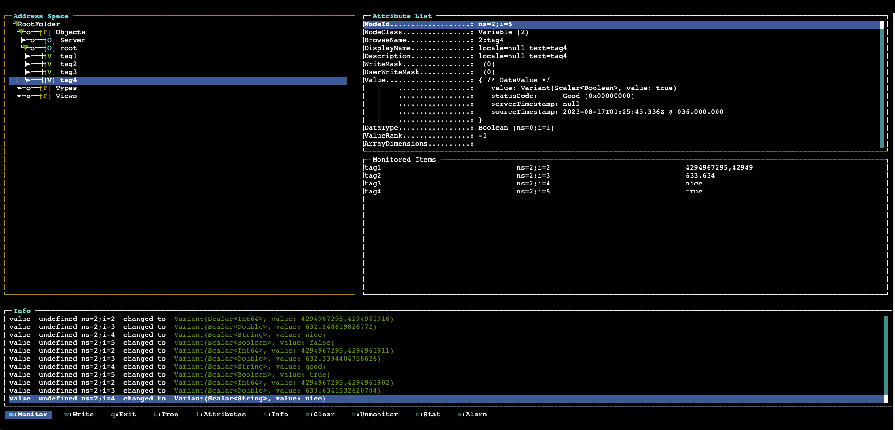
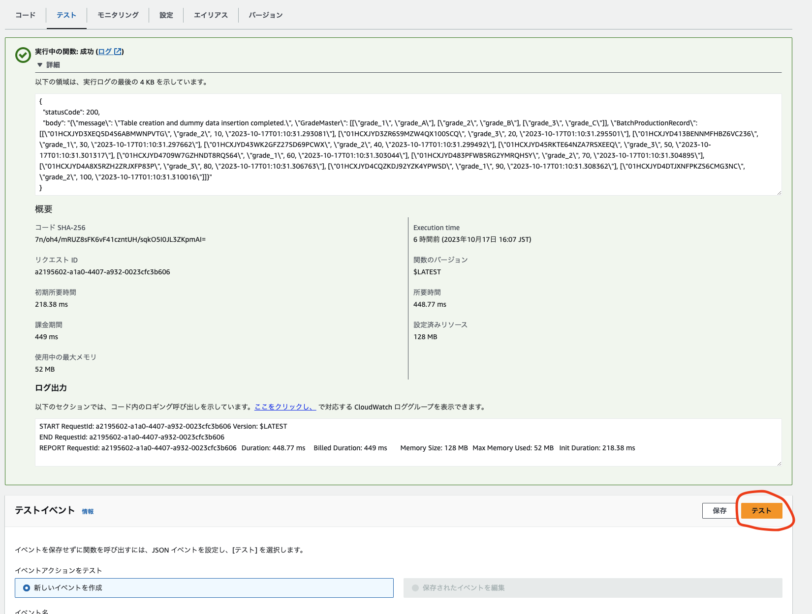
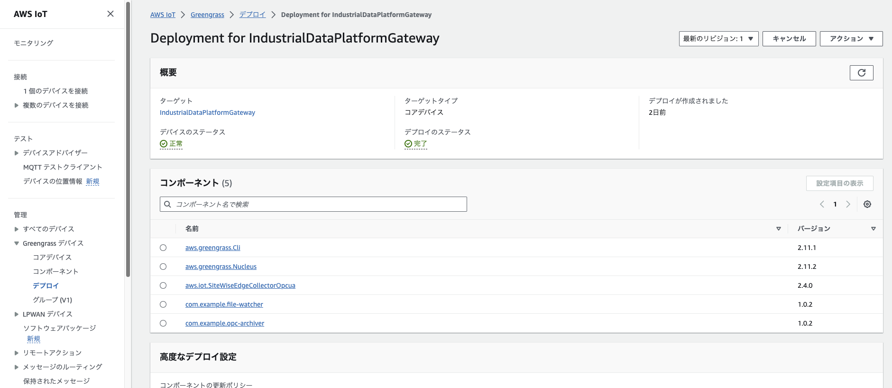
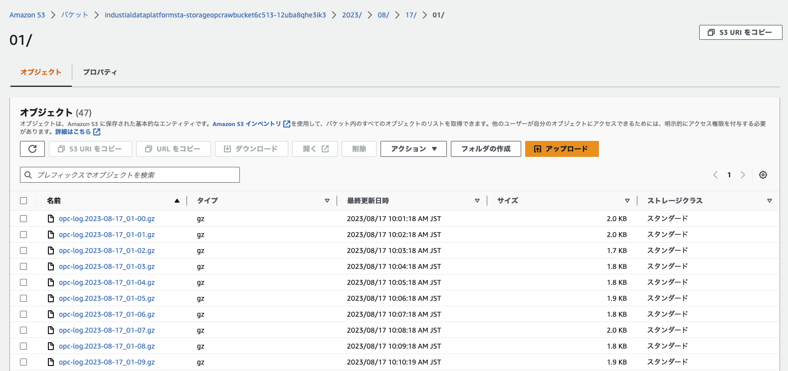

# エッジゲートウェイデバイスへ Greengrass をインストール

## Greengrass のインストール

ゲートウェイデバイス（以降、デバイスと呼称）へ Greengrass をインストールします。`cdk.json`に特に変更を加えていない場合、`factory1`および`factory2`の 2 つの仮想デバイスが作成されます。ここでは`factory1`のみに絞って動作確認を行います。

まず CloudFormation のページに AWS マネージメントコンソールからアクセスし、`IndustrialDataPlatformStack`をクリックしてください。その後`出力`タブをクリックし、インストールコマンドを控えます。ここでは`GreengrassBootstrapfactory1GreengrassInstallCommandForLinux`を控えます。

コマンド例 (Linux):

```sh
sudo -E java "-Droot=/greengrass/v2" "-Dlog.store=FILE" -jar /GreengrassInstaller/lib/Greengrass.jar --aws-region ap-northeast-1 --thing-name IndustrialDataPlatformGateway --thing-policy-name IndustrialDataPlatformGatewayThingPolicy --tes-role-name IndustrialDataPlatformStac-GreengrassBootstrapGreen-XXXXX --tes-role-alias-name IndustrialDataPlatformStac-GreengrassBootstrapGreen-XXXXXAlias --component-default-user ggc_user:ggc_group --provision true --setup-system-service true --deploy-dev-tools false
```

控えたコマンドを仮想デバイス上のターミナルで実行します。マネージメントコンソールの EC2 インスタンス > IndustrialDataPlatformStack/VirtualDevice-factory1/Instance > 接続 > セッションマネージャーをご利用いただくことでターミナルへアクセスできます。

ターミナルアクセス後、控えたコマンドを実行する前に Greengrass 本体をダウンロードし展開します。[参考](https://docs.aws.amazon.com/greengrass/v2/developerguide/manual-installation.html#download-greengrass-core-v2)

```sh
cd /home/ssm-user
curl -s https://d2s8p88vqu9w66.cloudfront.net/releases/greengrass-nucleus-latest.zip > greengrass-nucleus-latest.zip
unzip greengrass-nucleus-latest.zip -d GreengrassInstaller && rm greengrass-nucleus-latest.zip
java -jar ./GreengrassInstaller/lib/Greengrass.jar --version
```

続いて、先ほど控えたコマンドを実行します。下記のような出力が得られれば成功です。

```
C:\Users\Administrator>java "-Droot=C:\greengrass\v2" "-Dlog.store=FILE" -jar .\GreengrassInstaller/lib/Greengrass.jar --aws-region ap-northeast-1 --thing-name Prototype-OPC-Gateway --thing-policy-name OPC-GatewayThingPolicy --tes-role-name OPC-GatewayTokenExchangeRole --tes-role-alias-name OPC-GatewayTokenExchangeRoleAlias --component-default-user ggc_user --provision true --setup-system-service true --deploy-dev-tools true
Provisioning AWS IoT resources for the device with IoT Thing Name: [Prototype-OPC-Gateway]...
Found IoT policy "OPC-GatewayThingPolicy", reusing it
Creating keys and certificate...
Attaching policy to certificate...
Creating IoT Thing "TestSite"...
Attaching certificate to IoT thing...
Successfully provisioned AWS IoT resources for the device with IoT Thing Name: [Prototype-OPC-Gateway]!
Setting up resources for aws.greengrass.TokenExchangeService ...
Attaching TES role policy to IoT thing...
Encountered error - User: arn:aws:iam::000000000000:user/gg_install_user is not authorized to perform: iam:GetPolicy on resource: policy arn:aws:iam::aws:policy/OPC-GatewayTokenExchangeRoleAccess because no identity-based policy allows the iam:GetPolicy action (Service: Iam, Status Code: 403, Request ID: f7f45511-0d49-4a21-88f8-6207736e995d); No permissions to lookup managed policy, looking for a user defined policy...
Downloading Root CA from "https://www.amazontrust.com/repository/AmazonRootCA1.pem"
Created device configuration
Successfully configured Nucleus with provisioned resource details!
Creating a deployment for Greengrass first party components to the device
Configured Nucleus to deploy aws.greengrass.Cli component
Default user creation is only supported on Linux platforms, Greengrass will not make a user for you. Ensure that the user exists and password is stored. Continuing...
Successfully set up Nucleus as a system service
```

デバイスが AWS へ登録されていることの確認のため、下記のコマンドを実行します。**このコマンドは Greengrass をインストールしたデバイスではなく、CDK をデプロイした端末のターミナルで実行してください。**

```sh
aws iot describe-thing --thing-name factory1
```

下記のような出力が得られれば成功です。

```json
{
  "defaultClientId": "factory1",
  "thingName": "factory1",
  "thingId": "xxxxxxx",
  "thingArn": "arn:aws:iot:ap-northeast-1:xxxxxx:thing/factory1",
  "attributes": {},
  "version": 1
}
```

## Thing グループへの追加

セットアップしたデバイスを、IoT Thing グループへ追加します。マネコンで[モノのグループ](https://console.aws.amazon.com/iot/home?region=ap-northeast-1#/thingGroupHub)へアクセスし、`IndustrialDataPlatformGatewayGroup` > `モノ`タブ > `モノを追加`をクリックします。前節までのセットアップが完了していれば`factory1`が選択肢に現れるはずですので、`factory1`をグループに追加します。現れない場合は Greengrass が正しくセットアップされていないので、前節をもう一度見直してみてください。

## (Optional) OPC-UA サーバの動作確認

この手順はオプショナルです。デバイスが OPC-UA サーバと通信が可能かどうかを確認します (要 Node.js 環境)。まずは[opcua-commander](https://github.com/node-opcua/opcua-commander)をインストールします。

```
sudo npm i -g opcua-commander
```

続いて下記のコマンドを実行します。なおアドレス (X.X.X.X)・ポート (YYYY) はお使いの OPC-UA サーバ設定に合わせてください。**以降の手順は Greengrass をインストールしたデバイス上で実行してください。**

```
opcua-commander -e opc.tcp://X.X.X.X:YYYY
```

下記は仮想デバイス上のダミー OPC-UA サーバにアクセスする場合の例です。

```
opcua-commander -e opc.tcp://127.0.0.1:52250
```

ツールの操作方法は、 カーソルキーでツリーを展開していきます。今回対象とする値は、RootFolder > Objects > factory1 以下に展開できます。この値をモニタしていくためには、モニタしたい値を選択し、 m キーを押します。値の詳細を確認するには、 l キーを押し Attribute List をカーソルで動かして確認します。プログラムを終了するには q キーを押します。ダミーの OPC-UA サーバでは下記のタグが確認できます。

- factory1/tag1: Int (整数)
  - 制御指示値、カウント数などのタグを想定
- factory1/tag2: Double (浮動小数点)
  - 温度や湿度、圧力などのタグを想定
- factory1/tag3: String (文字列)
  - good / bad などステータス用のタグを想定
- factory1/tag4: Boolean (ブール値)
  - ON / OFF を表すタグを想定



OPC-UA サーバが正しく動作・接続されていれば、値を確認できるはずです。

## ダミーレコードの挿入

ダミーの Postgres データベースへレコードを挿入します。マネージメントコンソールの Lambda > `IndustrialDcataPlatformSta-DummyDataIngestorXXX`をクリックし、テストタブ > 「テスト」ボタンをクリックします。下記のようなレスポンスが得られれば成功です。



## データベース情報の設定

[cdk.json](../../cdk/cdk.json)を開き、データベースの情報を設定します。具体的には`rdbHost`および`rdbPassword`を編集します。`rdbHost`はマネコン > CFn > 出力タブ > `DummyDatabaseHostnameXXXX`の値から確認できます。また`rdbPassword`はマネコン > Secrets Manager > `DummyDatabaseSecretXXXX` > 「シークレットの値を取得する」から確認できます。その他の値は下記を参考にしてください。

```json
    "rdbHost": "industrialdataplatformsta-dummydatabaseclusterxxxx.ap-northeast-1.rds.amazonaws.com",
    "rdbPort": "5432",
    "rdbUser": "root",
    "rdbPassword": "YYYY",
    "rdbDatabase": "prototype",
    "rdbExportIntervalSec": 60
```

## Greengrass コンポーネントをデバイスへデプロイ

下記コマンドで Greengrass コンポーネント (file-watcher, opc-archiver, SiteWiseEdgeCollectorOpcua など) を上記でセットアップしたデバイスへデプロイします。**このコマンドは Greengrass をインストールしたデバイスではなく、IndustrialPlatformStack をデプロイした端末のターミナルで実行してください。**

```
cdk deploy GreengrassComponentDeployStack --require-approval never
```

マネージメントコンソールの IoT Core > Greengrass デバイス > デプロイ > Deployment for IndustrialDataPlatformGateway へアクセスし、「デバイスのステータス」および「デプロイのステータス」が共に完了となっていることを確認してください。



OPC-UA サーバが稼働している場合は即座にデータの収集が開始されます。マネージメントコンソールの S3 > バケットにアクセス後、OPC の Raw バケット (industrialdataplatformsta-storageopcrawbucketXXXX...という名前のバケット) の中身を見ると、2023/08/15/03/opc-log.2023-08-15_03-00.gz のようなファイルが生成されていることが確認できるはずです。



オブジェクトの中身は S3 select を使用して、入力設定を形式を JSON、JSON コンテンツタイプを行、圧縮を GZIP、出力設定を JSON としてクエリ実行して中身を確認してみてください。
下記のような中身のデータを確認できれば正しくクラウド送信されてきていることを確認できたことになります。

```json
{
  "propertyAlias": "/root/tag1",
  "propertyValues": [
    {
      "value": {
        "integerValue": 16
      },
      "timestamp": {
        "timeInSeconds": 1685005466,
        "offsetInNanos": 163000000
      },
      "quality": "GOOD"
    },
    {
      "value": {
        "integerValue": 47
      },
      "timestamp": {
        "timeInSeconds": 1685005464,
        "offsetInNanos": 162000000
      },
      "quality": "GOOD"
    },

```

## Greengrass コンポーネントのデプロイに関するトラブルシューティング

「デバイスのステータス」および「デプロイのステータス」が完了にならない場合や OPC データが S3 バケットに収集されない場合、下記項目をご確認ください。

### Greengrass のログ

コンポーネントのエラーログを直接確認しエラーの原因を調査します。ログは下記にファイルとして出力されます。Greengrass が出力するログの詳細については[こちら](https://docs.aws.amazon.com/greengrass/v2/developerguide/monitor-logs.html#access-local-logs)を参照ください。

- Windows

```ps1
C:\greengrass\v2\logs\
```

ログのリアルタイムモニタリングの例 (PowerShell):

```ps1
Get-Content -Path C:\greengrass\v2\logs\com.example.rdb-exporter.log -Wait -Tail 10
```

- Linux

```
/greengrass/v2/logs/
```

ログのリアルタイムモニタリングの例:

```sh
sudo tail -f /greengrass/v2/logs/
```

### IoT SiteWise ステータスの確認

マネージメントコンソールの IoT SiteWise > エッジ > ゲートウェイ > sitewise-gateway にアクセスし、データソースの設定ステータスが同期中であるか確認します。通常デプロイ後しばらくすると同期中のステータスになりますが、非同期の場合は設定したデータソースのラジオボタンを選択し、編集ボタンを押して編集画面に移り、何も変更せずに保存をクリックすることで同期中に変更できることがあります。

### ストリームマネージャが生成するストリームファイルの確認

SiteWise コンポーネントが OPC データを収集するとストリームに書き込まれますが、ストリームの実体は下記のパスに存在します。

Windows:

```
C:\greengrass\v2\work\aws.greengrass.StreamManager\opc_archiver_stream
```

Linux:

```
/greengrass/v2/work/aws.greengrass.StreamManager/opc_archiver_stream
```

ここにファイルがない場合は、SiteWise のマネージメントコンソールのステータスが同期中になっているか、再度見直してみてください。

## ファイルの転送の確認

続いてデバイス上のファイルが S3 へ転送されることを確認します。監視対象のディレクトリ (cdk.json に設定した sourceDir の値) に移動し、下記の内容の CSV ファイルを適当な名前で保存します。

```csv
BatchID,ProductName,StartTime,EndTime
Batch1,productD,2023-08-02 02:50:02,2023-08-02 04:15:02
Batch2,productD,2023-07-27 02:50:02,2023-07-27 04:35:02
Batch3,productA,2023-08-10 02:50:02,2023-08-10 04:04:02
Batch4,productE,2023-07-19 02:50:02,2023-07-19 03:43:02
Batch5,productE,2023-07-31 02:50:02,2023-07-31 03:57:02
Batch6,productB,2023-07-28 02:50:02,2023-07-28 04:04:02
Batch7,productB,2023-08-14 02:50:02,2023-08-14 04:39:02
Batch8,productA,2023-07-21 02:50:02,2023-07-21 04:00:02
Batch9,productA,2023-08-05 02:50:02,2023-08-05 04:09:02
Batch10,productE,2023-08-04 02:50:02,2023-08-04 03:33:02
```

仮想デバイスをご利用の場合は sourceDir が/home/ggc_user/data 下のため、下記コマンドを実行し移動してください。

```
sudo su - ggc_user
cd data
```

なお Linux 環境下の場合は下記コマンドを実行することで上記と同等のファイルを生成できます。仮想デバイスをご利用の場合はそのままコピー&ペーストし実行してください。

```shell
filename=$(date +%s).csv
echo "BatchID,ProductName,StartTime,EndTime" > $filename
products=("productA" "productB" "productC" "productD" "productE")
for i in $(seq 1 100); do
  product=${products[$RANDOM % ${#products[@]}]}
  start_time=$(date -d "$((RANDOM % 30)) days ago" +"%Y-%m-%d %H:%M:%S")
  random_minutes=$((RANDOM % 91 + 30)) # 30から120のランダムな数（30分から2時間）
  end_time=$(date -d "@$(($(date -d "$start_time" +%s) + $random_minutes * 60))" +"%Y-%m-%d %H:%M:%S")
  echo "Batch$i,$product,$start_time,$end_time" >> $filename
done
```

これまでのデプロイが成功していれば、数秒以内に ファイルの Raw バケット (industrialdataplatformsta-storagefilerawbucketXXX...という名前の S3 バケット) に転送されます。転送されない場合は Greengrass のログをご確認ください。

## 加工処理の確認

OPC・ファイル共に S3 バケットに転送されることを確認できたら、Lambda による加工が実施されるか確認しましょう。

### OPC

OPC データは 1 時間ごとにタグによるパーティショニングを実行します。しばらく待機したのち、OPC の Processed バケット (industrialdataplatformsta-storageopcprocessedbucke...という名前のバケット) の中身が確認できれば加工処理は成功しています。なおエッジ側のタイムスタンプの遅延を考慮するため、処理は毎時 10 分 (00:10, 01:10, ..., 23:10) に実行される点に留意ください。毎時 10 分を過ぎても生成されない場合、Lambda のログをご確認ください。

### ファイル

Raw バケットに格納されると、即座に加工用の Lambda により、加工済みのデータが Processed バケット (industrialdataplatformsta-storagefileprocessedbuck...という名前の S3 バケット) に保存されます。バケットの中身を確認してみてください。保存されない場合、Lambda のログをご確認ください。

---

以上の手順により、エッジ側デバイスのデータをクラウドに転送・加工することができます。この後は S3 のデータにアクセスし自由に分析や可視化が実行可能です。Athena による SQL クエリ例については[Athena によるクエリ例](./athena_example.md)を参照ください。またリソースの破棄については[こちら](./destroy_ja.md)をご覧ください。

以降、本ドキュメントでは QuickSight を利用し可視化を実施する手順について解説します。なお QuickSight は本プロジェクトの動作確認のために用意した仮想デバイス・ダミーの OPC-UA サーバを利用することを想定している点にご留意ください。では[QuickSight の設定のデプロイ](./deploy_quicksight_ja.md)へお進みください。

また実環境への適用をトライされたい場合は[こちら](./actual_env.md)へお進みください。
