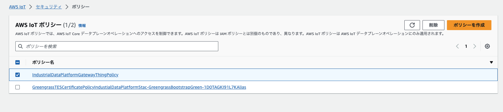

# リソースの破棄について

下記の手順で実施してください。

## (Optional) QuickSight のスタックをデプロイした場合

下記コマンドを実行するか、または CloudFormation のページから`QuicksightStack`を手動で削除してください。

```
cdk destroy QuicksightStack
```

## コンポーネントデプロイのスタック削除

下記コマンドを実行するか、または CloudFormation のページから`GreengrassComponentDeployStack`を手動で削除してください。

```
cdk destroy GreengrassComponentDeployStack
```

### 確認

マネージメントコンソールの AWS IoT > Greengrass > デプロイをクリックし、`GreengrassComponentDeploy`という名前のデプロイが存在しなければ OK です。

## 産業データプラットフォームのスタック削除

マネージメントコンソール > AWS IoT > セキュリティ > ポリシーから`IndustrialDataPlatformGatewayThingPolicy`を選択し削除します。



続いて下記コマンドを実行するか、または CloudFormation のページから`IndustialDataPlatformStack`を手動で削除してください。

```
cdk destroy IndustialDataPlatformStack
```

CloudFormation のスタック一覧から`IndustrialDataPlatformStack`が消えていれば削除は完了となります。
