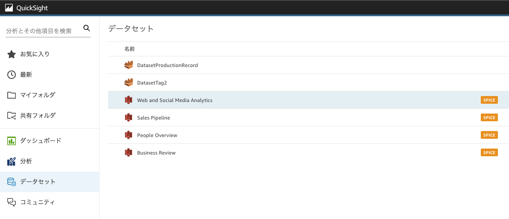
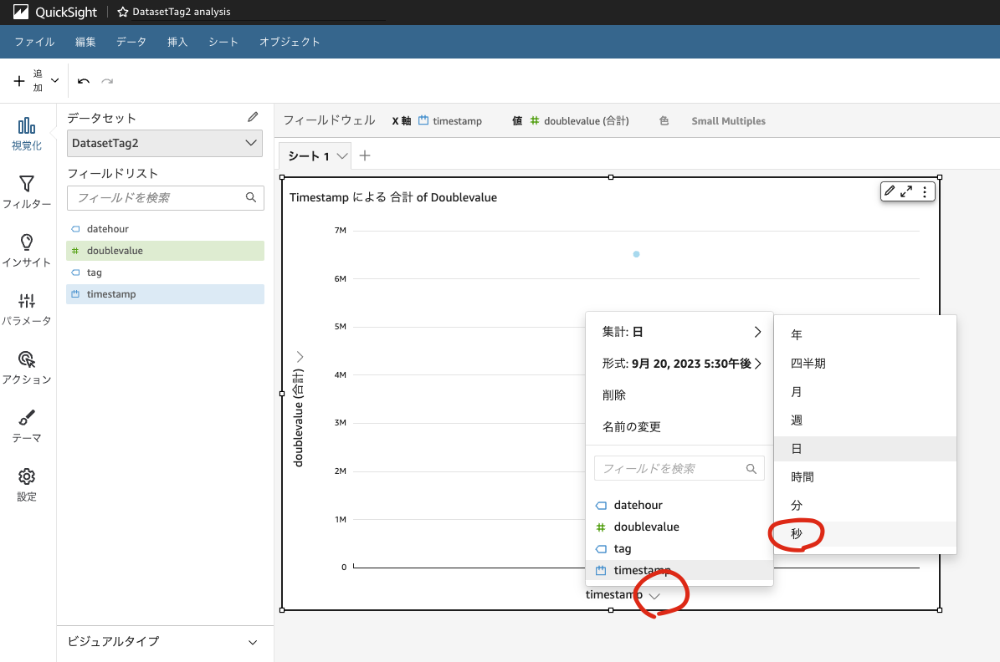
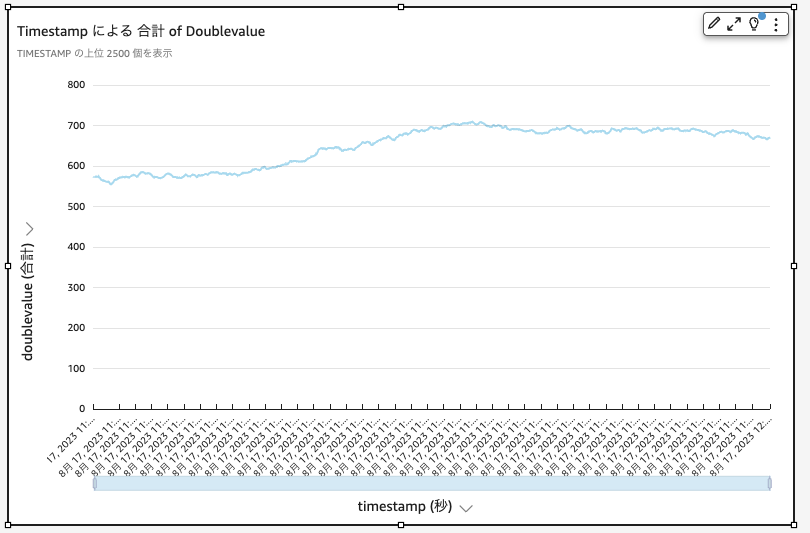
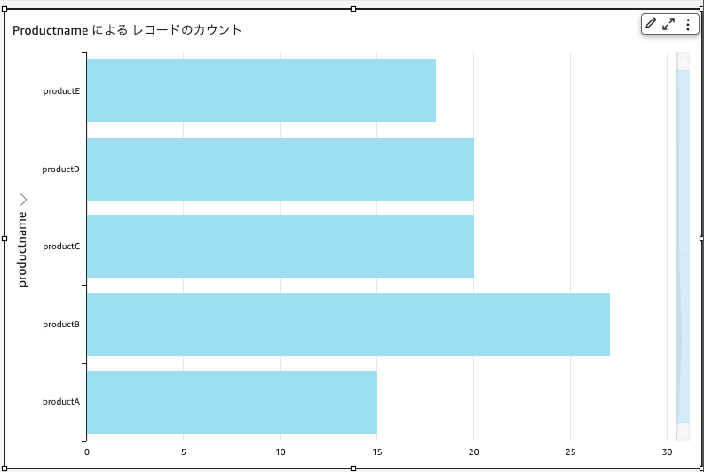
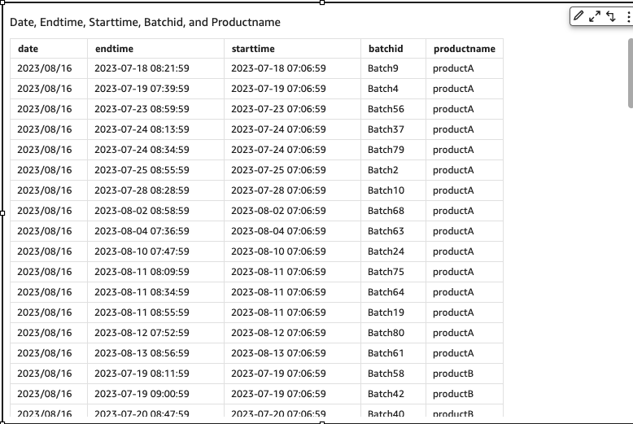

# QuickSight でデータを分析・可視化

QuickSight のデータセットにアクセスすると、CDK でデプロイしたデータセットが確認できます。

- DatasetTag2
  - OPC-UA ダミーサーバで生成した root/tag2 のデータセット
- DatasetProductionRecord
  - 転送した CSV ファイルのデータセット

## OPC タグの可視化

まず分析 > 新しい分析をクリックし、新規に分析を作成します。データセットが表示されるので、DatasetTag2 を選択してください。その後「分析で使用」ボタンをクリックします。「インタラクティブシート」を選択後、「作成」ボタンをクリックします。

続いて左ペインのパラメータをクリックすると、DatasetParameters の中に「start」「end」が確認できます。Map parameter > Create New をクリックし、それぞれ固定日付に下記を入力後「作成」をクリックします。

- start: 明日の日付
- end: 今日の日付

以上の操作により、分析したい OPC タグデータの期間が指定されます。続いて左ペインの視覚化をクリックし、doublevalue および timestamp をクリックして選択します。その後 timestamp の集計に秒または分を設定します。OPC-UA の/root/tag2 の本日分のトレンドが表示されるはずです。

## CSV ファイルの可視化

データセット > データセットの追加をクリックし、DatasetProductionRecord を選択します。続いて DatasetParameter の中に新しく「date」が確認できますので、同様に Create New をクリックし、固定日付に本日の日付 (CSV ファイルを作成した日) を入力します。その後、フィールドリストの productname をクリックすると、製品名ごとの生産数を可視化できます。

またすべてのフィールド (batchid, date, ..., starttime) を選択し、ビジュアルタイプからテーブルを選択すると、表形式で出力が可能です。

ここで分析したいバッチ ID の開始時刻と終了時刻を確認し、先ほど設定した start / end のパラメータを設定し直すことで、そのバッチの設備データを確認することができます。

以上で QuickSight の説明を終えます。ここでの説明は非常に簡単なものですので、より深く基本を学ばれたい方は[ハンズオン](https://catalog.us-east-1.prod.workshops.aws/workshops/aa601d0b-84c9-4f77-b9a7-5954d8574cd5/ja-JP)等実施いただくことをお勧めします。また、製造サプライチェーンにおける課題をデータドリブンな意志決定により解決するなど、より高度な用途で QuickSight をご活用いただくことも可能です。詳しくは[AWS ブログ](https://aws.amazon.com/jp/blogs/news/making-data-driven-decisions-in-manufacturing-and-logistics-with-amazon-quicksight/)をご覧ください。
